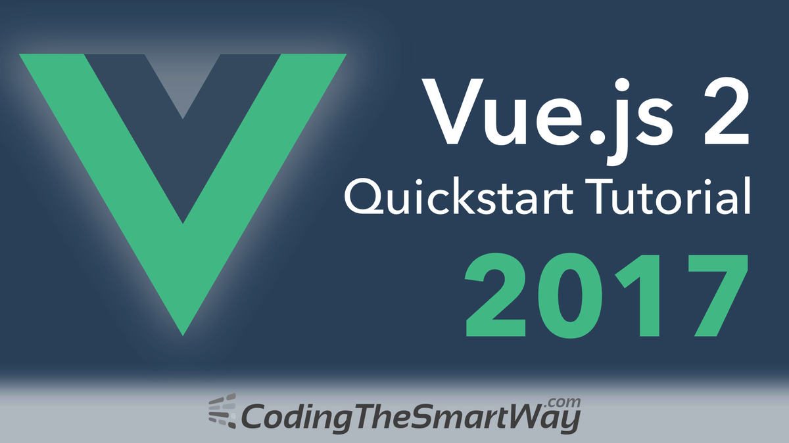
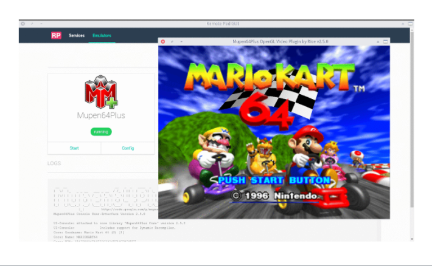
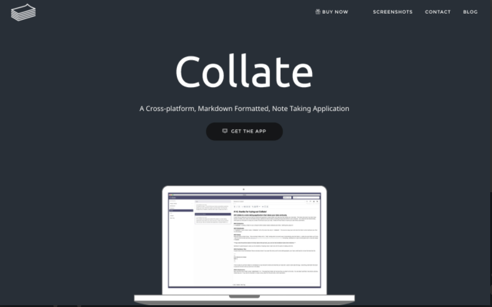
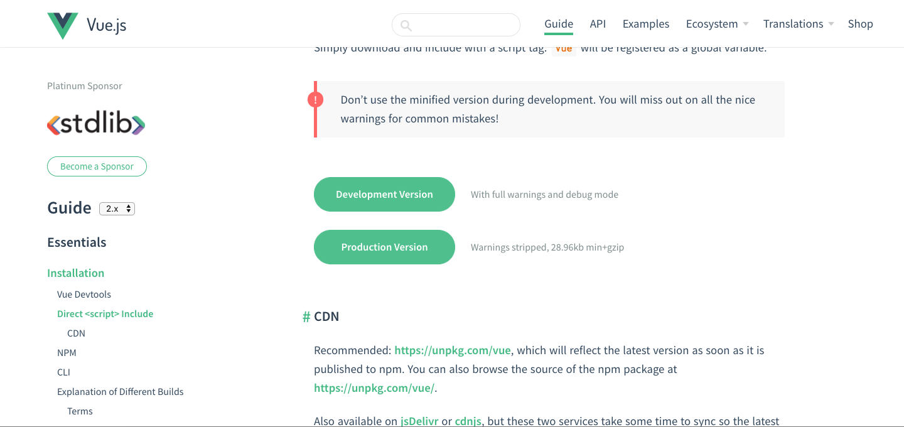

# Vue.JS Tutorial
 
By Bianca Cortes and Ivan Alvarez

## What is Vue.js?
Vue is a versatile, performant, and approachable framework that emphesises minimalistic flow and syntax with an incrementally adoptable stack that can handle apps of any scale. It is an open-source progressive JavaScript framework for building user interfaces. Integration into projects that use other JavaScript libraries is made easy with Vue. Vue can also function as a web application framework capable of powering advanced single-page applications.

According to a 2016 JavaScript survey, Vue has an 89% developer satisfaction rating. It accumulates around 95 GitHub stars per day, and is the 10th most starred project on GitHub of all time.

## History
<!-- bianca -->

VueJS was created by Evan You and released February 2014.  Evan worked for Google on AngularJS which inspired him to create his won lightweight version of the AngularJS framework.  VueJS which is a javascript framework that has many great pieces of AngularJS but not as monolithic. VueJS like AngularJS uses HTML as a template language.  Just three years after its debut VueJS is now amongst one of the most popular open sourced frameworks used by developers.

## Major Applications That Used Vue
<!-- bianca -->
Some major apps made with VueJS are the :

* *Remote Pad GUI* which launches an emulator on your computer that allows you to connect your smartphone to to be used as a remote control. It manages both Remote Pad and Remote Pad Server. These two services are responsible for integrating your smartphone and your desktop to send keyboard strokes to control your favorite games.
 

* *Collate* A locally hosted, cross-platform note-taking app that allows the user to take notes Collate Note Types allowing the user to choose between Rich Text, Markdown, Outline or Web Clipper note types to take notes more effectively.
 

To view more apps, websites, frameworks, etc the  [made with vue js ](https://madewithvuejs.com/?page=3) website has a huge stash of everything VueJS.

## Getting Started 

#### Vue-specific syntax is stored in a library that can be access in two ways, locally or externally

For local access download go to [www.vuejs.com](https://vuejs.org/v2/guide/installation.html).




#### Or

For external access without installations necessary, insert this script link element provided  below sourced by [cdnjs](cdnjs.com), an npm-based third party library.

This block of code is inserted within the head of your html structure:

    <script type="text/javascript" src="https://cdnjs.cloudflare.com/ajax/libs/vue/2.4.2/vue.min.js"></script>


## "Hello World!"

#### Ready to get your hands dirty? Whats a better way to learn anything then to greet the world? 

<!-- describe and snip -->
If the first step indicated in GETTING STARTED is down packed then you are ready to proceed. 

At the core of Vue.js is a system that enables us to declaratively render data to the DOM using straightforward template syntax:

```
<div id="app">
  {{ message }}
</div>
```

The code provided below is the javascript responsible for rendering our greeting. It is wrapped in script tags and placed within body, at the very bottom, beneathe the content: 
```
<script>
    new Vue ({
        el: '#app',
        data: {
        'message':'What up 🌏'
        }
    });

</script> 
```

## Components

### Components can be registered globally or locally. 

#### This is how  global component is registered : 
>Vue.component(componentName, options)
the above method -> .component takes two parameters within the parenthesis.  The first argument is then
name of the component while the second parameter where it says options is where a function will go and properties could be passed through there, it will look more like this: 

>Vue.component(componentName,{
    >template: '<p>re-usable code goes here</p>
>
>})

#### This component will be utilized by writing this in your index.html : 
 <componentName></componentName>


#### This is how you register a component locally within the scope of that component: 
>var Child = {
>  template: '<div>custom component goes here</div>'
>}
>new Vue({
>  components: {
>    // <my-component> will only be available in parent's template
>   'my-component': Child
>  }
>})

# References

### Youtube intro quickies
* [10 minute intro to Hello World](https://www.youtube.com/watch?v=DsuTwV0jwaY&t=60s)
* [Framework comparison rhetorical](https://www.youtube.com/watch?v=KMX1mFEmM3E)

### Articles, blogs, and websites
* [First Week of Launching](http://blog.evanyou.me/2014/02/11/first-week-of-launching-an-oss-project/index.html)
* [Evan You](https://betweenthewires.org/2016/11/03/evan-you/)
* [Vue.js Releases and Updates](https://github.com/vuejs/vue/releases)
* [Apps and websites made with VueJS](https://madewithvuejs.com/?page=3)


